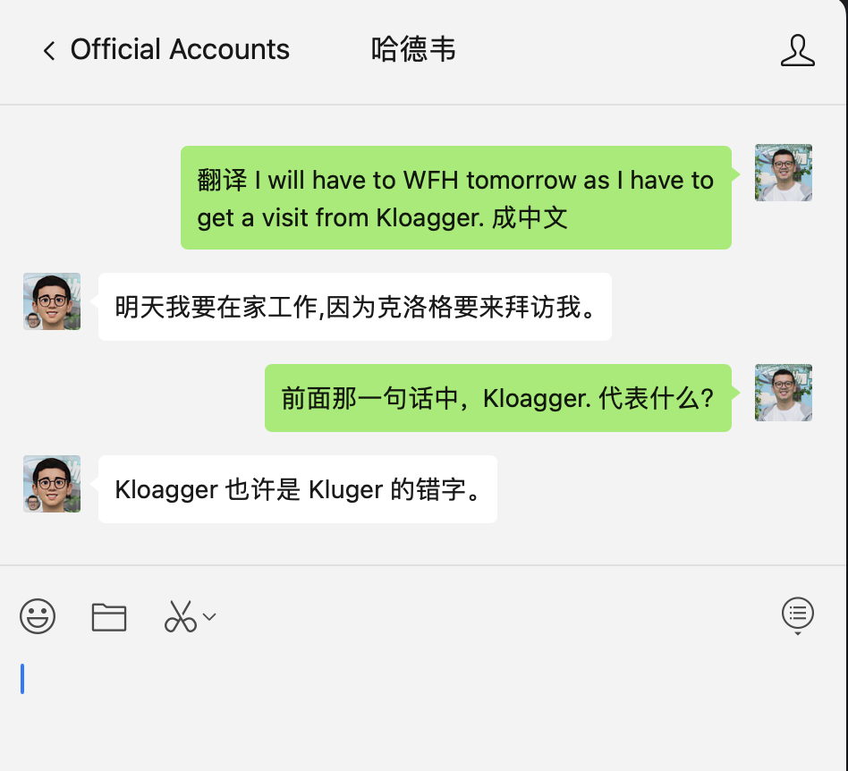
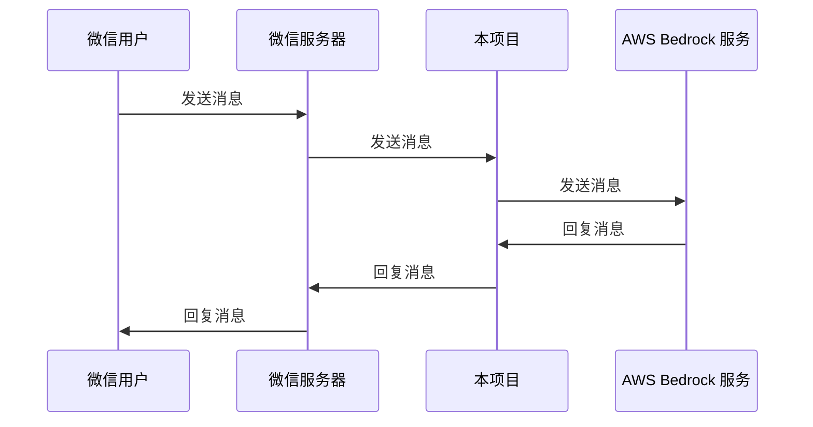
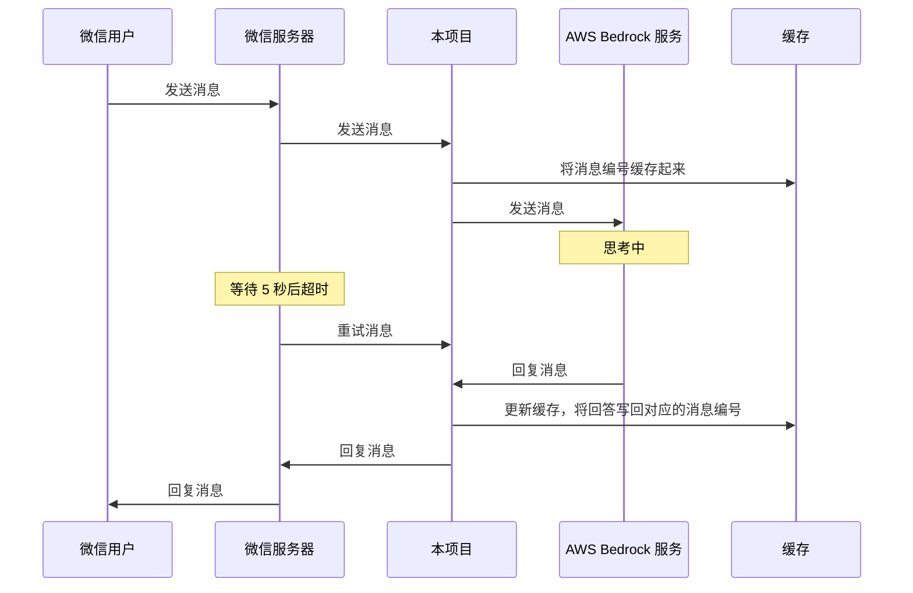
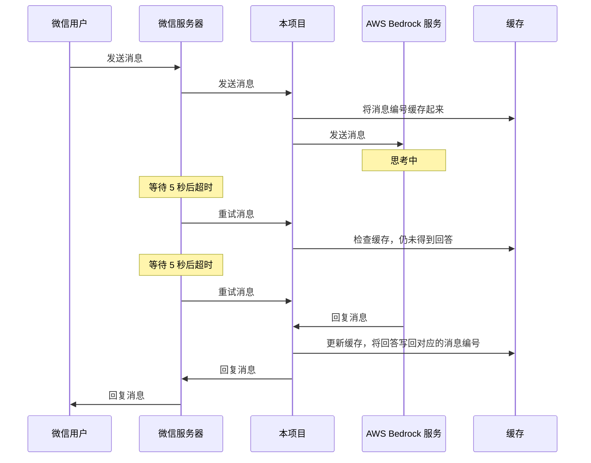
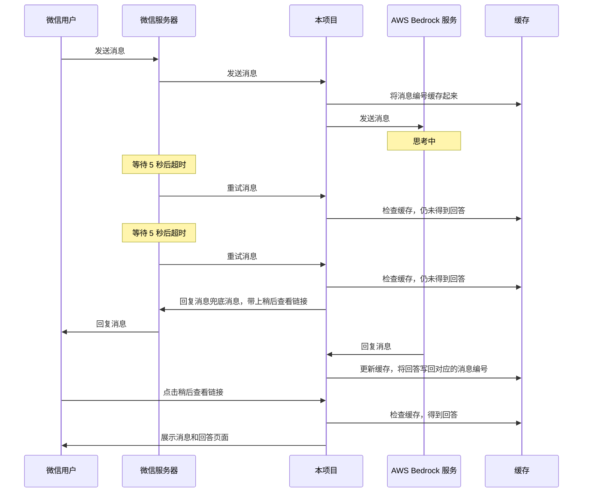
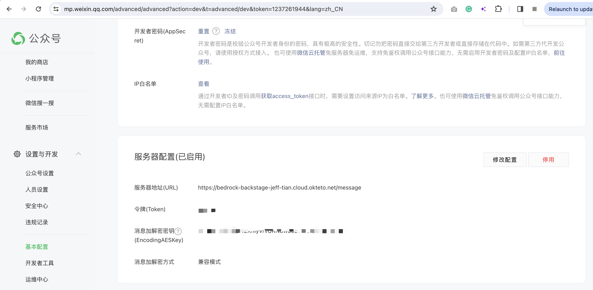

bedrock

---

> 调用 AWS Bedrock 服务，为微信公众号消息提供自动回复功能。

## 体验

关注“哈德韦”公众号，发送任意消息即可体验。


效果如下图所示：



## 为什么有这个库

微信公众号提供了自动回复功能，但是不够智能，只能根据关键字进行回复。这个库可以让你的公众号更加智能，可以根据用户的消息内容，调用 AWS Bedrock 服务，得到更加智能的回复。当然，关键字回复也是同时支持的，即使 AWS Bedrock 服务没有响应，也会回复提前设置好的关键字回复。

即该库在微信公众号自动回复的基础上，**增加**了智能回复的功能。是一个 AI 增强的微信公众号自动回复库。

## 难点

调用 AWS Bedrock 服务本身并不难，难点在于微信服务器的限制。微信服务器只等待 5 秒，如果超过 5 秒没有响应，就会重试。而最多重试 3 次，如果 3 次都没有响应，用户就会收不到回复。而微信服务器等待 5 秒的时间，是包括网络传输的时间的，所以，实际上，从接收到微信服务器发来的消息，一次只有不到 5 秒的时间来响应。而 AWS Bedrock 服务的响应时间很可能超过 5 秒，所以，这里使用了缓存，如果是同一消息，就不再调用 AWS Bedrock 服务，而是等待上次的调用结果。如果到第 3 次还没收到 AWS Bedrock 服务的响应，那就只能回复提前设置好的关键字回复了（当然，在这时，可以带上一个链接，允许用户稍后查看回复结果）。

## 时序图

有时候，AWS Bedrock 服务的响应很快，时序图如下：



有时候，AWS Bedrock 服务的响应很慢，引起了微信服务器的一次重试，时序图如下：



如果再慢一点，就会引起两次重试，时序图如下：



以上是终于在微信服务器的重试次数内得到了回复的情况。如果 AWS Bedrock 服务的响应时间超过了微信服务器的重试次数，那么，就只能回复提前设置好的关键字回复了。时序图如下：



## 测试

```bash
yarn test
```

## 部署

可以部署到任意 Kubernetes 集群。注意如果采用了内存缓存，replica 就需要设置成 1，如果设置成多个 Pod，会导致缓存失效。

如果采用了 Redis 缓存，可以设置成多个 Pod，但是，需要注意，如果 Pod 重启，缓存会丢失，所以，需要设置成多个 Pod 的时候，需要使用 Redis 缓存。

本来本项目部署在 Okteto 提供的免费 Kubernetes 集群上，域名是 https://bedrock-backstage-jeff-tian.cloud.okteto.net/message ，但是在 2024 年 1 月 15 日，Okteto 关闭免费服务。于是对本项目进行了重新部署，选择 cyclic，它是一个无服务器平台，不能再使用内存缓存，因为微信服务的消息重试会打在不同的实例上。好在，cyclic 提供了方便的 DynamoDb 存储，于是，将缓存从内存缓存改成了 DynamoDb 缓存。

## 缓存

由于微信公众号消息只等待 5 秒，而调用 AWS Bedrock 服务很可能在超过 5 秒后才能得到响应。超时后微信会再重试请求，为了避免重复调用 AWS Bedrock 服务，这里使用了缓存，如果是同一消息，就不再调用 AWS Bedrock 服务，而是等待上次的调用结果。

## 公众号后台配置

如何让你的微信公众号支持自动回复功能？只需要将该项目部署，然后在公众号后台配置即可。


